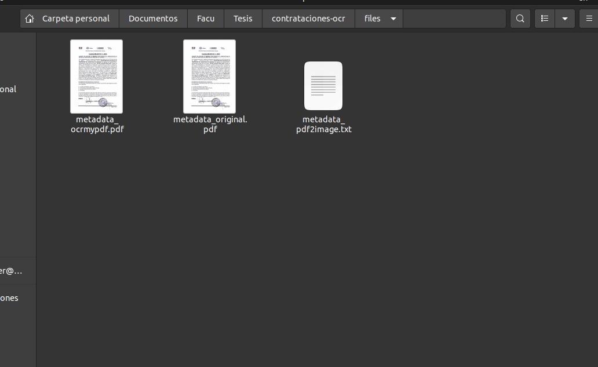

# OCR de Contratros


## Comandos 
Comandos para correr el proyecto

* En la raiz del proyecto ejecutar los siguientes comandos:

```bash
  docker build -t ocr-contrataciones .
```

```bash
  docker run -v `pwd`/files:/app/files ocr-contrataciones
```

## Resultados

* En raiz del proyecto se creara una carpeta con los siguientes archivos:


